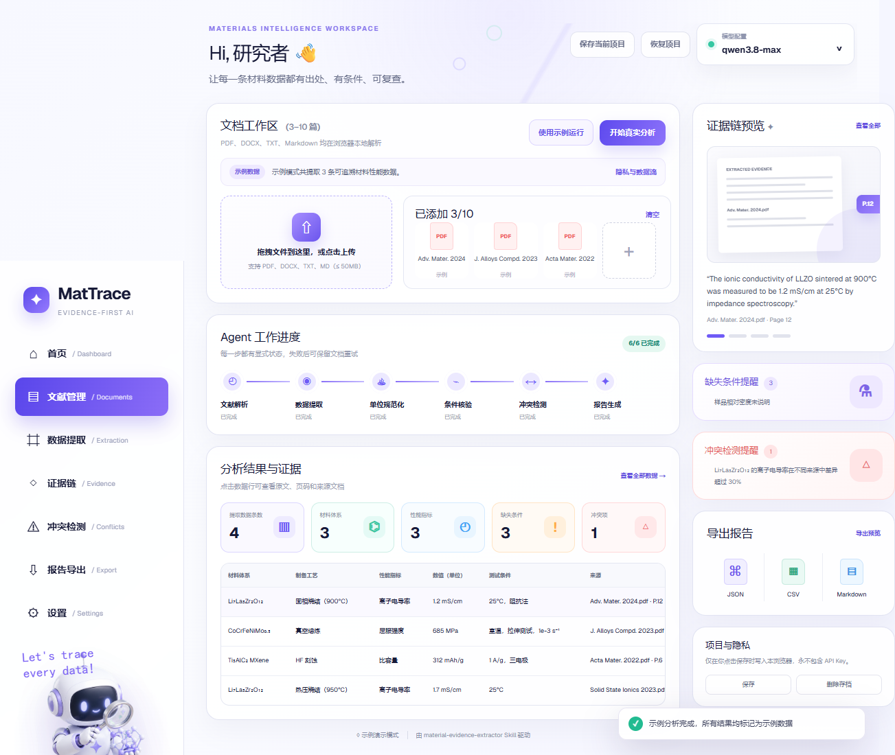

# MatTrace


> 学长跟我说：「AI 写的，别挂我名。」
>
> 那我就做一个让 AI 提取的每一条材料数据，**都能被追溯、被质疑、敢挂名**的工具。

MatTrace 是一个面向材料科研的文献数据提取与核验 Agent。它把论文、专利或技术数据表（TDS）转换成带**原文证据、页码定位、测试条件和可信度**的结构化数据，并自动提醒条件缺失和跨文献数值冲突——让 AI 读完的每一篇文献，都有据可查。



## 背景与来源

AI 读文献很快，但科研里真正要命的是这三个问题：

1. AI 提取出的数值，你敢直接写进论文吗？
2. 它说「这个材料电导率是 1.2 mS/cm」——你知道出自**哪一页**吗？
3. 两篇文献数据差了 50%，你确定它们的**测试条件一样、真的能比**吗？

大多数 AI 文献工具，三个问题都答不上来。MatTrace 就是为了回答它们而做的：**项目优先是一个真正能用的工具，其次才是参赛作品。** 演示中所有数据均来自三篇真实 arXiv 论文，没有一条是编造的；网页端启动即为空，不预载任何模拟结果。

## 资源链接

- **源码仓库**：<https://github.com/LucianaiB2004/mattrace>
- **演示视频（B 站）**：<https://www.bilibili.com/video/BV1qPuK6TEMp/>
- **在线演示**：通过 GitHub Pages 静态部署（见下方「构建与发布」）

## 方法

我们把「让 AI 输出可信」拆成两层：先想清楚**该信什么**，再用 Agent **把这件事做出来**。

### 一、思考方法：证据优先，而非模型自信

核心原则是**不信任模型的自报置信度，只信任可复查的证据**。一条材料数据要被采纳，必须同时回答五个问题：什么材料、如何制备、测了什么性能、在什么条件下测的、原文在哪里。缺失的内容就标记为缺失，绝不用常识或模型推断去补全。

由此推导出三条确定性规则（全部由代码计算，不交给模型主观判断）：

- **证据绑定**：数值、单位必须能在原文证据句（或同页表头）中定位，且必须带来源文档与页码。
- **可比性门槛**：先按材料、性能、单位、温度、方法、方向等关键条件分组，**条件不兼容的记录绝不放在一起比较**；证据质量再高也不能单独授权「可比较」。
- **冲突检测**：仅对条件兼容的记录，按相对差异 > 30%（分母为两值绝对值中较小者）标记冲突，发现冲突后保留两个值并上报，绝不静默覆盖。

可信度分为**高 / 中 / 低**三档，每一档都给出具体扣分原因（数值未定位、单位在表头、缺哪项测试条件等）。它衡量的是「证据可追溯的程度」，而不是「这个材料结论为真的概率」。

### 二、Agent 方法：六阶段可解释流水线

MatTrace Agent 把上述思考固化为一条有显式状态、失败可重试的流水线，每一步都对用户可见：

1. **文献解析** —— 浏览器本地用 PDF.js / Mammoth 解析 PDF、DOCX、TXT、Markdown，保留原始页码。
2. **数据提取** —— 按「材料 + 性能 + 带物理单位的数值」从证据句中抽取结构化记录，忽略引文编号、表格序号和无单位数字。
3. **单位规范化** —— 按确定性换算表机械换算（S/cm、mS/cm、µS/cm、GPa→MPa、W/mK、mAh/g、% 等），同时保留原值、原单位和换算轨迹；范围/极限/近似值不改成精确单值。
4. **条件核验** —— 检查温度、方法、频率、方向、致密度等与该性能相关的条件，未报告字段写入 `missing_conditions`。
5. **冲突检测** —— 条件分组后做 30% 相对差异比对，输出冲突对与差异百分比。
6. **报告生成** —— 生成逐文档覆盖矩阵、逐条可比性护照、JSON/CSV/Markdown 报告和人工复核队列。

工程上还做了两件让链路真正能跑通的事：**截断 JSON 修复**（括号配对 + 安全点截断，从被截断的流式输出里抢救已完整的记录）和**本地 CORS 代理**（只放行固定上游，不记录 Key、正文或响应）。

## Skill 使用方法

正式的、可复用的能力封装在 [`skills/material-evidence-extractor/`](skills/material-evidence-extractor/) 中。它不依赖任何供应商专有工具调用，任何遵守同一输入/输出 Schema 的模型都能使用。

### 目录结构

```
skills/material-evidence-extractor/
├── SKILL.md                       # 能力说明、工作流与置信度合同
├── agents/openai.yaml             # Agent 接口声明
├── references/                    # 机器可读 Schema 与规则
│   ├── input-schema.json
│   ├── output-schema.json
│   ├── unit-normalization.md      # 确定性单位换算表
│   ├── coverage-and-comparability.md  # 四维评分规则
│   ├── failure-cases.md
│   ├── evaluation-protocol.md
│   └── output-example.md
├── examples/                      # 真实论文的样例输入/输出与七类交付物
└── scripts/
    ├── extract-evidence.mjs       # 证据候选抽取
    ├── normalize-record.mjs       # 单位规范化
    ├── build-deliverables.mjs     # 生成七类交付物
    ├── score-uplift.mjs           # 客观评分 / uplift 计算
    └── verify-skill.mjs           # 最小复现自检
```

### 使用步骤

1. **准备输入**：按 [`references/input-schema.json`](skills/material-evidence-extractor/references/input-schema.json) 组织文档，每篇含 `document_id`、名称、类型、页数和分页文本。可直接参考 [`examples/sample-input.json`](skills/material-evidence-extractor/examples/sample-input.json)（三篇真实论文全文）。
2. **让模型执行 Skill**：读取 `SKILL.md`，把 `references/` 下的输出字段规范、单位换算表、评分规则和失败案例作为上下文，要求模型**只返回 JSON**。
3. **确定性后处理**：用 `scripts/normalize-record.mjs` 对模型输出做机械换算与字段校验，再用 `scripts/build-deliverables.mjs` 生成交付物。
4. **生成七类交付物**：`records.jsonl`、`comparison.csv`、`evidence-report.md`、`missing-and-conflicts.md`、`review-queue.csv`、`coverage-matrix.csv`、`comparability-passports.jsonl`。
5. **评分（可选）**：用金标准对单次输出打分：

   ```bash
   node skills/material-evidence-extractor/scripts/score-uplift.mjs \
     --gold examples/sample-gold.jsonl \
     --pred examples/sample-output.json
   ```

### 最小复现自检

```bash
node skills/material-evidence-extractor/scripts/verify-skill.mjs
```

它会校验 Schema、样例文档数量、七类交付物，并验证样例输出对金标准的自评分为 1.0。当前输出：

```json
{"ok":true,"schema_validated":true,"example_records":1,"document_outcomes":4,"deliverables":7,"sample_records":5,"sample_self_score":1}
```

## Agent（网页端）使用方法

### 依赖与运行

要求 **Node.js ≥ 22.13.0**。

```bash
npm install
npm run dev
```

打开 <http://localhost:3000>。

如果所用 OpenAI-compatible 网关的响应没有浏览器 CORS 头，另开一个终端运行仅限 localhost 的固定上游代理：

```bash
npm run proxy:ai
```

在 localhost 上，MatTrace 会把火山方舟 Agent Plan 映射到 `/ark-plan`、ChipCloud 映射到 `/chipcloud` 本地路由。代理只允许这两个固定上游，不接受任意 URL，也不记录 API Key、文献正文或模型响应。

### 操作步骤

1. **添加文档**：拖拽或点击上传 PDF / DOCX / TXT / Markdown（单文件 ≤ 50 MB，最多 20 篇），或点击「载入公开论文」载入三篇内置真实 arXiv 论文。
2. **配置模型**：右上角「模型配置」选择供应商预设或自定义网关，输入 API Key。Key 只保存在当前浏览器 `localStorage`。
3. **选择文档并分析**：勾选参与分析的文档，点击「开始真实分析」。六阶段进度实时可见，支持取消、失败后保留文档重试。
4. **查看结果**：表格展示全部记录，点击任意行查看原文证据、页码和来源文档；右侧抽屉可浏览全部数据、证据、缺失条件、冲突和可比性护照。
5. **导出报告**：支持 JSON（规范化字段）、带 UTF-8 BOM 的 CSV、完整 Markdown 报告，以及覆盖矩阵 CSV 与可比性护照 JSONL。
6. **保存/恢复**：通过 IndexedDB 在本浏览器保存当前文档与分析结果，可手动「恢复存档」或「清除存档」；应用启动始终为空，不会自动恢复。

### 模型供应商预设

| 供应商 | 协议 | 网关 | 模型 |
| --- | --- | --- | --- |
| 火山方舟 Agent Plan | OpenAI Responses API | `https://ark.cn-beijing.volces.com/api/plan/v3` | `doubao-seed-evolving` |
| ChipCloud | OpenAI Chat Completions | `https://ai.chipcloud.cc` | `qwen3.8-max` |
| 自定义 | Chat Completions 或 Responses API | 用户填写 | 用户填写 |

火山方舟 Agent Plan 预设请求 `https://ark.cn-beijing.volces.com/api/plan/v3/responses`（即 `api/plan/v3/responses`，OpenAI Responses API）。Skill 不绑定特定供应商：各模型都以相同 Schema 和确定性后处理接受验证，返回截断、无效 JSON 或缺少文档状态时，该文档进入失败/重试流程，不会静默省略。

### 评审模型兼容

- 首选模型：Qwen3.8-Max（项目默认标识 `qwen3.8-max`）。
- 多模态备用：Qwen3-vl-Plus，适用于表格图片、图注或扫描页面已经过 OCR/视觉转写的输入。
- 纯文本备用：GLM 5.2，必须遵守同一 JSON Schema，不降低证据和页码要求。
- 图像生成备用：Wan2.7-Image-Pro 不参与科学数据抽取，只能制作演示视觉，生成内容不得作为材料证据。

### 隐私模型

- API Key 只存在当前浏览器 `localStorage`，**不写入** Git、构建产物、IndexedDB 快照、URL、日志或导出报告。
- 原始文件在浏览器本地解析；只有点击「开始真实分析」后，文档名、页码和解析文本才会发送到你配置的网关。
- 项目快照在写入 IndexedDB 前会经过敏感字段断言，防止 Key 误入存档。

## 构建与验证

```bash
npm test            # 领域、API、解析、导出、存储、SSR 测试
npm run lint        # ESLint
npm run test:e2e    # Playwright 浏览器交互验收
```

生成 GitHub Pages 静态产物：

```bash
npm run build:static
```

输出目录为 `dist/client/`（含 `index.html` 与 `.nojekyll`）。仓库自带 `.github/workflows/pages.yml`，推送到 `main` 后在仓库 **Settings → Pages → Build and deployment** 选择 **GitHub Actions** 即可自动发布。

## 目录结构

- `app/domain/`：分析结果、冲突、导出、单位规范化、工作流与安全快照
- `app/services/`：文档解析、AI 协议客户端、本地代理、IndexedDB
- `app/components/`：设置、详情抽屉和通知组件
- `skills/material-evidence-extractor/`：可复用 Skill 与输出协议
- `scripts/`：本地代理、静态导出、Skill 工作区同步
- `tests/`：单元、集成、SSR 和浏览器测试
- `docs/`：界面预览与设计资料

## 致谢

感谢三篇真实 arXiv 论文的作者提供公开数据，作为本项目演示与评测的事实基础；也感谢每一位愿意让 AI 输出「有据可查」的研究者。

Let's trace every data.

## 开源协议

本项目采用 [MIT License](LICENSE)。允许使用、修改、分发和再许可，但需保留版权与许可声明。
