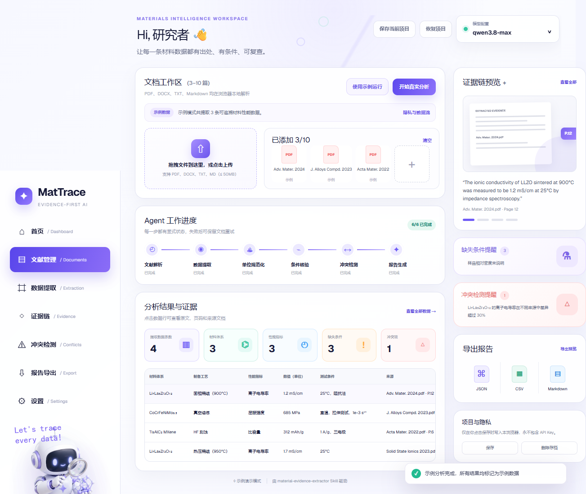

# MatTrace Agent（网页端）

MatTrace Agent 是材料证据抽取 Skill 的交互式可视化前端：在浏览器本地解析 PDF/DOCX，调用兼容 OpenAI 协议的模型完成抽取，并把六阶段流水线（文献解析→数据提取→单位规范化→条件核验→冲突检测→报告生成）完整展示出来。Skill 本体在仓库根的 [`../skills/material-evidence-extractor/`](../skills/material-evidence-extractor/)。



## 依赖与运行

要求 **Node.js ≥ 22.13.0**。

```bash
npm install
npm run dev
```

打开 <http://localhost:3000>。

如果所用 OpenAI-compatible 网关的响应没有浏览器 CORS 头，另开一个终端运行仅限 localhost 的固定上游代理：

```bash
npm run proxy:ai
```

在 localhost 上，MatTrace 会把火山方舟 Agent Plan 映射到 `/ark-plan`、ChipCloud 映射到 `/chipcloud` 本地路由。代理只允许这两个固定上游，不接受任意 URL，也不记录 API Key、文献正文或模型响应。

## 操作步骤

1. **添加文档**：拖拽或点击上传 PDF / DOCX / TXT / Markdown（单文件 ≤ 50 MB，最多 20 篇），或点击「载入公开论文」载入三篇内置真实 arXiv 论文。
2. **配置模型**：右上角「模型配置」选择供应商预设或自定义网关，输入 API Key。Key 只保存在当前浏览器 `localStorage`。
3. **选择文档并分析**：勾选参与分析的文档，点击「开始真实分析」。六阶段进度实时可见，支持取消、失败后保留文档重试。
4. **查看结果**：表格展示全部记录，点击任意行查看原文证据、页码和来源文档；右侧抽屉可浏览全部数据、证据、缺失条件、冲突和可比性护照。
5. **导出报告**：支持 JSON（规范化字段）、带 UTF-8 BOM 的 CSV、完整 Markdown 报告，以及覆盖矩阵 CSV 与可比性护照 JSONL。
6. **保存/恢复**：通过 IndexedDB 在本浏览器保存当前文档与分析结果，可手动「恢复存档」或「清除存档」；应用启动始终为空，不会自动恢复。

## 模型供应商预设

| 供应商 | 协议 | 网关 | 模型 |
| --- | --- | --- | --- |
| 火山方舟 Agent Plan | OpenAI Responses API | `https://ark.cn-beijing.volces.com/api/plan/v3` | `doubao-seed-evolving` |
| ChipCloud | OpenAI Chat Completions | `https://ai.chipcloud.cc` | `qwen3.8-max` |
| 自定义 | Chat Completions 或 Responses API | 用户填写 | 用户填写 |

火山方舟 Agent Plan 预设请求 `https://ark.cn-beijing.volces.com/api/plan/v3/responses`（即 `api/plan/v3/responses`，OpenAI Responses API）。Skill 不绑定特定供应商：各模型都以相同 Schema 和确定性后处理接受验证，返回截断、无效 JSON 或缺少文档状态时，该文档进入失败/重试流程，不会静默省略。

### 评审模型兼容

- 首选模型：Qwen3.8-Max（项目默认标识 `qwen3.8-max`）。
- 多模态备用：Qwen3-vl-Plus，适用于表格图片、图注或扫描页面已经过 OCR/视觉转写的输入。
- 纯文本备用：GLM 5.2，必须遵守同一 JSON Schema，不降低证据和页码要求。
- 图像生成备用：Wan2.7-Image-Pro 不参与科学数据抽取，只能制作演示视觉，生成内容不得作为材料证据。

### 隐私模型

- API Key 只存在当前浏览器 `localStorage`，**不写入** Git、构建产物、IndexedDB 快照、URL、日志或导出报告。
- 原始文件在浏览器本地解析；只有点击「开始真实分析」后，文档名、页码和解析文本才会发送到你配置的网关。
- 项目快照在写入 IndexedDB 前会经过敏感字段断言，防止 Key 误入存档。

## 构建与验证

```bash
npm test            # 领域、API、解析、导出、存储、SSR 测试
npm run lint        # ESLint
npm run test:e2e    # Playwright 浏览器交互验收
```

生成 GitHub Pages 静态产物：

```bash
npm run build:static
```

输出目录为 `dist/client/`（含 `index.html` 与 `.nojekyll`）。仓库根的 `.github/workflows/pages.yml` 在 `agent/` 目录下构建并部署，推送到 `main` 后在仓库 **Settings → Pages → Build and deployment** 选择 **GitHub Actions** 即可自动发布。

## 目录结构

- `app/domain/`：分析结果、冲突、导出、单位规范化、工作流与安全快照
- `app/services/`：文档解析、AI 协议客户端、本地代理、IndexedDB
- `app/components/`：设置、详情抽屉和通知组件
- `scripts/`：本地代理、静态导出、Skill 工作区同步
- `tests/`：单元、集成、SSR 和浏览器测试
- `public/`：内置公开论文 PDF 与静态资源

## 开源协议

本项目采用 [MIT License](LICENSE)。允许使用、修改、分发和再许可，但需保留版权与许可声明。
